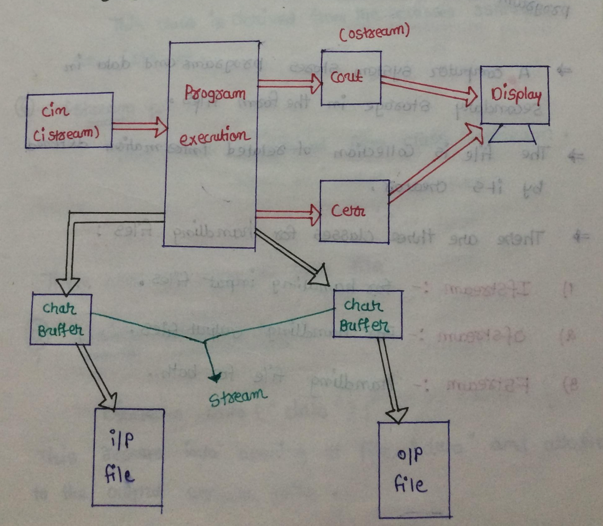

# File Handling

- File Opening Methods
    - Using Constructor
    - Using open()

- File Operations
    1. Open a file.
    2. Read and Write Operation on a file.
    3. Closing a file.


# Stream

- `stream` mean data flow bewteen two aims.



- A computer system stores program and data in secondary storage in the file form.
- The `file` is a collection of related information defined by its creator.

- There are three classes for handling files
    - `ifstream` : for handling input files.
    - `ofstream` : for handling output files.
    - `fstream` : Handling files for both input and output.


## Stream class model

- **ios** : This class is the base class for all the other classes.
- **istream** : This class is derived from class `ios`.
- **ostrea** : This class is derived from class `istream`.
- **ofstream** : This class is derived from `ostream`.
- **iostream** : This class is derived from the classes `ostream` and `istream`.
- **fstream** : This class is derived from class iostream.

## Mode Of Opening a file

|C|C++|
|---|---|
|r|ios::in|
|r+|ios::in\|ios::out|
|w|ios::out|
|w+|ios::out\|ios::in\|ios::trunc|
|a|ios::app\|ios::out|
|a+|ios::app\|ios::in\|ios::out|

- by default the file will open in write mode.
- in fstream file is not created automatically.
- when we open the file then use the mode operation.

## Open Extensions

- To open file we can also pass "open_mode" as second argument.
```c++
object.open(filename, open_mode);
```
|Mode|Description|
|---|---|
|ios::app|Append to the end of file.|
|ios::in|open file in reading mode.|
|ios::out|open file in writing mode.|
|ios::trunc|If the content of the file already exists, the delete the data.|


## Opening and Closing files

- There are two ways to Open file 
    - Using Constructor

        ```c++
        ofstream ofile("data");
        ```
        - This results in opening of file "data" and attaches to the output stream ofile.
    
    **Program**

    ```c++
    #include<iostream>
    #include<fstream>
    using namespace std;
    int main() 
    {  
        ofstream fout("data"); // open a file using constructor method
        fout << "Hello World" << endl;
        fout << "Welcome to Beautiful world" << endl;
        fout << "Nice to meet all" << endl; 
        fout.close();
    }
    ```

    - Using open()
        - File-stream-class stream-object;
        ```c++
        stream_object.open("filenname");
        ```
        Example

        ```c++
        ofstream ofile;
        ofile.open("data");
        ```
    **Program**

    - Reading line using char array.

    ```c++
    #include<iostream>
    #include<fstream>
    using namespace std;
    int main() 
    {  
     ifstream fin;
     fin.open("data"); // open a file using open()
     char s[20];
     //fin >> s;   // read one word
      fin.getline(s,20); // read one line
     cout << s << endl;
     fin.close(); 
    }        
    ```
    - Reading line using string

    ```c++
    #include<iostream>
    #include<fstream>
    using namespace std;
    int main() 
    {  
        ifstream fin;
        fin.open("data"); // open a file using open()
        string s;
        //fin >> s;   // read one word
        getline(fin,s); // one line
        cout << s << endl;
 
       fin.close();
    }
    ```

### Program : Read the data char by char, word by word, line by line.

```c++
/*
read the data char by char,word by word,line by line 
*/
#include<iostream>
#include<fstream>
using namespace std;
int main(int argc,char **argv) 
{  
  if(argc!=2){
  cout << "usage: ./a.out filename" << endl;
  return 0 ;
  }
  char ch;
  ifstream fin(argv[1]);
  if(!fin){
   cout << "file not present" << endl;
   return 0;
  }
``` 
- read data char by char 
```c++
    while((ch=fin.get())!=-1)
    cout << ch << endl;
    string s;
```
- reading word by word 
```c++  
    while(fin >>s)
    cout << s << endl;
```
- read data line by line 
```c++
    while(getline(fin,s))
    cout << s << endl;
 
    fin.close();
}
```


### Program : Implementation of `wc` command

```c++
/*
implementation of wc command
*/
#include<iostream>
#include<fstream>
using namespace std;
int main(int argc,char **argv) 
{  
  if(argc!=2){
  cout << "usage: ./a.out filename" << endl;
  return 0 ;
  }
  char ch;
  ifstream fin(argv[1]);
  if(!fin){
   cout << "file not present" << endl;
   return 0;
  }
   int l=0,w=0,c=0;
```
- read data char by char
```c++
  while((ch=fin.get())!=-1)
  c++;
  
  fin.clear(); /////// clear internal bits
  fin.seekg(0,ios::beg);
    //cout << fin.tellg() << endl;
   string s;
```
- reading word by word
```c++
   while(fin >>s)
   w++;
   fin.clear(); /////// clear internal bits
   fin.seekg(0,ios::beg);
   //cout << fin.tellg() << endl;
```
- read data line by line
```c++
  while(getline(fin,s))
  l++;
  cout << l << " " << w << " " << c << " ";
  cout << argv[1] << endl;
  fin.close();
}
```

## File Navigation

### Manipulation function for file pointers

- **Mode**   
    - ios::beg
    - ios::cur
    - ios::end

- ### seekp()
    - This function move the pointer to a specified location to do a write operation.

    ```c++
    ofstream out("data");
    out.seekp(2, ios::beg);
    ```
   
- ### tellp()
    - This function tells current position of file pointer.

    ```c++
    int x;
    ofstream out("data");
    x = out.tellp();
    ```

- ### seekg()
    - This function move the pointer to a specified location to do read operation.

    ```c++
    ofstream out("data");
    out.seekg(2, ios::beg);
    ```

- ### tellg()
    - This function tell current positon of the file pointer.

    ```c++
    int x;
    ifstream out ("data");
    x = out.tellg();
    ```